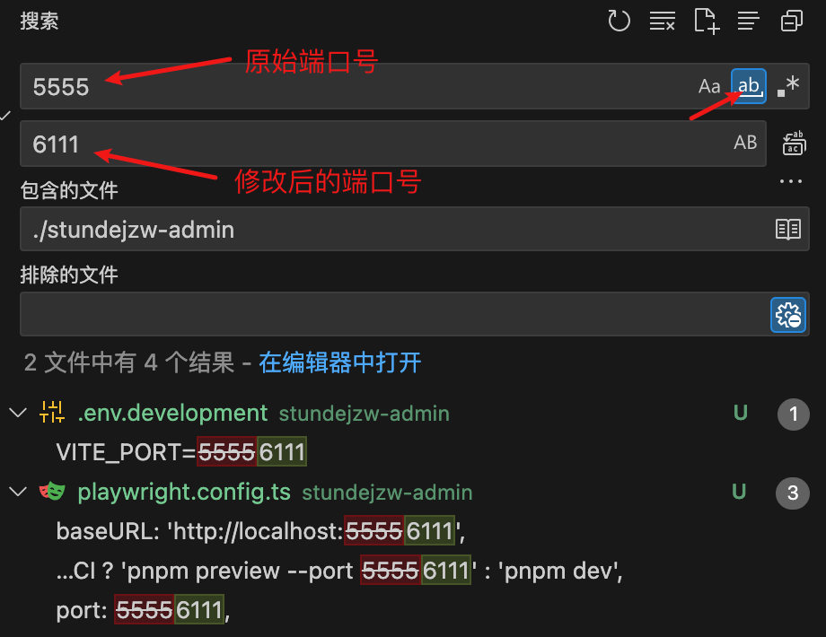

# 基于 playground 包新建项目（stundejzw-admin）

1. 拷贝项目目录下的 `playground` 文件夹并复制到项目目录下的 `apps` 文件夹中，命名为 `stundejzw-admin`。同时需要修改 `stundejzw-admin` 目录下的 `package.json` 文件，将 name 修改为 `stundejzw-admin`

```json
{
  "name": "@vben/stundejzw-admin"
}
```

2. 修改启动端口：在 `stundejzw-admin` 文件夹下搜索 `playground` 项目的端口号，并进行替换。



3. 在项目根目录下的 `package.json` 文件中添加相关命令。

```json
{
  "name": "vben-admin-monorepo",
  "scripts": {
    "build:admin": "pnpm run build --filter=@vben/stundejzw-admin",
    "dev:admin": "pnpm -F @vben/stundejzw-admin run dev"
  }
}
```

4. 安装依赖：`pnpm install`。

5. 运行项目：`pnpm dev`。
